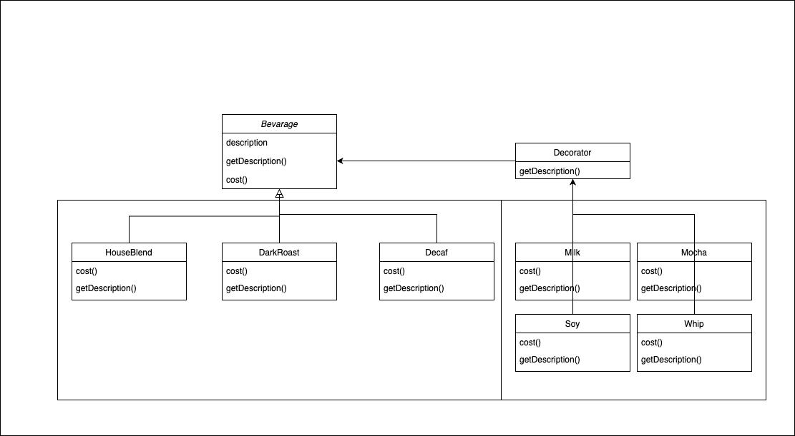

# 3. Decorator pattern
- 자신이 감싸고 있는 구성요소의 메소드를 호출한 결과에 새로운 기능을 더함으로써 행동을 확장하는 패턴


### 변경전


- 결국 클래스의 수가 폭발해버리고 맙니다.


### 변경후



### 주의할 점
- 특정 형식에 의존하는 코드에 데코레이터를 적용하는 것을 주의

```java
public class DecoratorTest {
    public static void main(String[] args) {
        Espresso espresso = new Espresso(); // ‼️특정 형식에 의존중‼️
        espresso = new Mocha(espresso); // 그 결과 데코레이터를 적용하면 에러가 남

        Mocha mocha = new Mocha(espresso);
        Soy soy = new Soy(mocha);
        Whip whip = new Whip(soy);
        System.out.println(whip.getDescription() + " $" + whip.cost());
    }
}
```

- 구성 요소를 초기화하는 데 필요한 코드가 복잡해짐
```java
public class DecoratorTest {
    public static void main(String[] args) {
        Beverage beverage = new Espresso();
        beverage = new Mocha(beverage);
        beverage = new Soy(beverage);
        beverage = new Whip(beverage);
        System.out.println(beverage.getDescription() + " $" + beverage.cost());
    }
}
```

### 복잡해진 코드를 해결하기 위해 Builder 패턴을 적용
```java
class BeverageBuilder {
    private Beverage beverage;

    public BeverageBuilder setBeverage(Beverage beverage) {
        this.beverage = beverage;
        return this;
    }

    public BeverageBuilder addDecorator(Decorator decorator) {
        decorator.setBeverage(beverage);
        this.beverage = decorator;
        return this;
    }
}

public class DecoratorTest {
    public static void main(String[] args) {
        Beverage beverage = new BeverageBuilder()
                .setBeverage(new Espresso())
                .addDecorator(new Mocha())
                .addDecorator(new Soy())
                .addDecorator(new Whip())
                .build();
        System.out.println(beverage.getDescription() + " $" + beverage.cost());
    }
}
```
### 복잡해진 코드를 해결하기 위해 Factory 패턴을 적용

```java
class BeverageFactory {
    public static Coffee createCoffee() {
        Beverage coffee = new DarkRoast();
        coffee = new Milk(coffee);
        coffee = new Soy(coffee);
        coffee = new Whip(coffee);
        return coffee;
    }
}

public class DecoratorTest {
    public static void main(String[] args) {
        Beverage beverage = BeverageFactory.createCoffee();
        System.out.println(beverage.getDescription() + " $" + beverage.cost());
    }
}
```