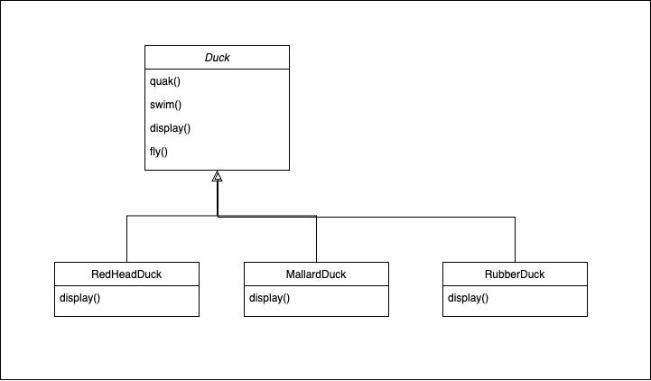
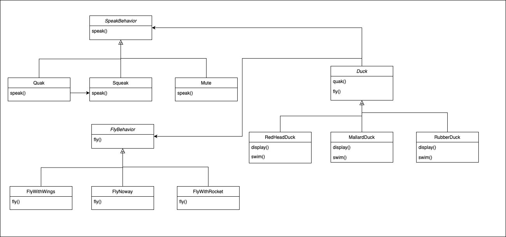

# 1. Strategy Pattern
- 달라지는 부분을 찾아서 나머지 코드에 영향을 주지 않돋록 **'캡슐화'** 하는 것.
- 바뀌는 부분은 따로 뽑아서 캡슐화한다. 그러면 나중에 바뀌지 않는 부분에는 영향을 미치지 않고 그 부분만 고치거나 확장할 수 있다.

### 변경전 다이어그램
- 특정 구현 (Duck) 에 의존하고 있기 때문에 **코드를 변경하지 않는 이상 행동을 추가하거나 변경하지 힘들다.**

### 변경후 다이어그램
- "A는 B이다."보다 "A에는 B가 있다."가 더 나을 수 있다.
- 각 오리는 FlyBehavior와 QuackBehavior가 있으며, 각각 나는 행동과 꽥꽥거리는 행동을 위임 받습니다. 이런 식으로 두 클래스를 합치는 것을 `Composition` 이라고 합니다.
- 변경후 오리는 행동을 상속받는 대신, 올바른 행동 객체로 구성되어 행동을 부여 받습니다.

